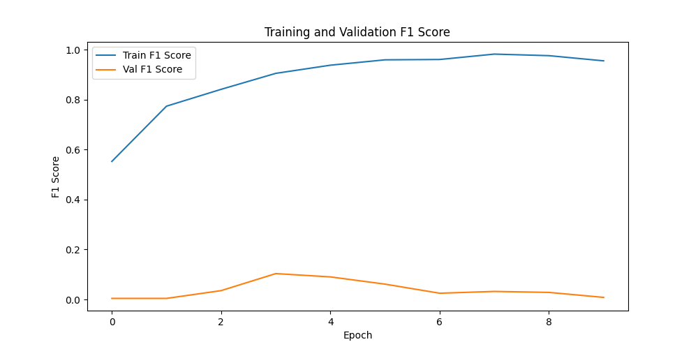

# 사용 방법
- 모델 학습방법: train.py가 있는 디렉토리에서 python train.py --device cuda
- gradio 사용 방법: gradio_interface.py에서 실행

# 수정 사항 05.30
- 중복된 코드 제거
- 사용하지 않는 라이브러리 제거
- dataset에서 경로를 인식하지 못해 코드 추가
```pytho행행
import os
import sys
# 현재 파일의 디렉토리를 가져온 후 상위 디렉토리 경로를 추가
sys.path.insert(0, os.path.dirname(os.path.dirname(os.path.abspath(__file__))))

from src.utils import initialize, label_description
```
- glob.glob()에서 데이터 파일을 읽는 경로가 train/train/ test/test 형식으로 되어있어 data의 test와 train 을 각 각 추가


# 수정사항 06.01
- efficentnet_b0 -> b4로 변경
- CNN2RNN 부분 제거 
- train에서 model()안에 안 사용하는 인자 제거후 class_n만 삽입
- img만을 입력값으로 하여 출력물을 받기로 하였으므로 train.py에서 taing_step 부분에 model()의 인자 및 csv관련 부분에서 img_feature 삭제 
- trainig_roop에 dataset.py에서 csv파일을 로드하는 과정이 있어 오류가 발생하였으므로 에서 csv를 받는 부분을 전부 삭제  

*git pull young 하는 과정에서 코드가 좀 꼬여서 juneon폴더 내려받고 수작업으로 옮긴 후 push 과정에서 또 오류가 발생해 그냥 git push --force 했습니다*

# 수정사항 06.02
- src.utils에서 label_description()의 label_description을 용하기 위해 이름을 label_description_dict로 수정하고 출력하게 만들었다
- label_description()을 label_decoder, label_encoder로 받았던 dataset에 받는 인자를 _로 하나 더 추가함
- gradio에서 predicted로 받은 텐서 값을 정수 인자로 바꾼 후 decoder로 해당 value를 출력하게 만듬 ex) 3_b7_3
- 이 값을 label_description_dict에 넣어줘 키로 value를 찾을 수 있게 함 ex ) 딸기 정상


# 수정사항 06.03
- argments 에서 device의 default 값을 cpu에서 cuda로 수정
- 학습률을 5e-4 에서 1e-4 로 에폭을30에서 10으로 수정
  
  
- split_dataset()에서 train,val,label_train,label_val 에서 X_train, X_test, Y_train, Y_test로 이름 변경

# trial2
  
  

# trial3
- 학습률 1e-3로 높인 후 시도
    
   

# trial4
- 데이터 증강 부분에 p= 0.2에서 0.3으로 조정
- 데이터 증강 부분에 이미지 축스 범위 줄임
    
  

# trial5
- model을 efficentb4에서 resnet101으로 교체
    
 


# 모델 프린트
    

# trial6
- model에서 dropout을 제거 (model은 다시 efficentb4)
    
 

# trial7
- 에폭 6
    
 

# trial8
- b4
    


# trial9
- b0와 b4 앙상블

